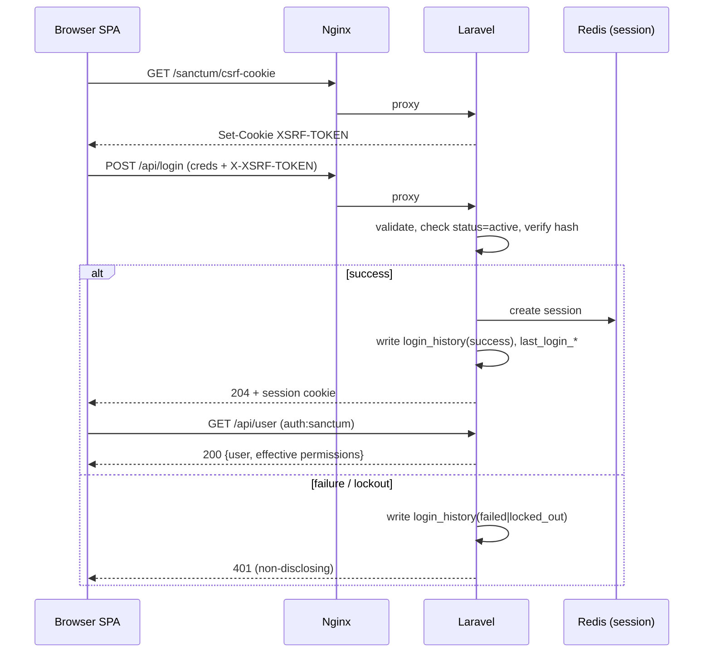
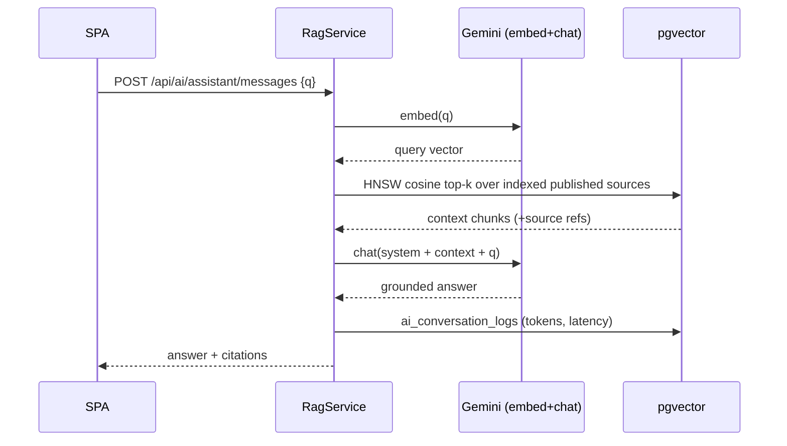
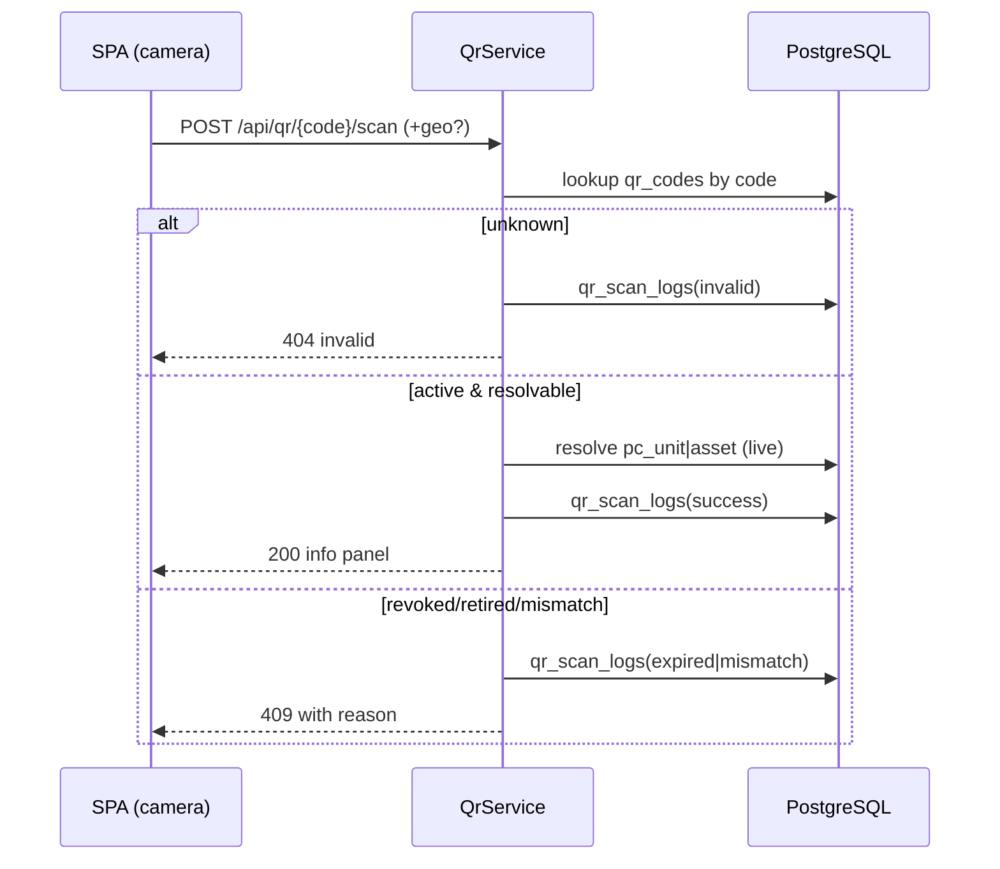
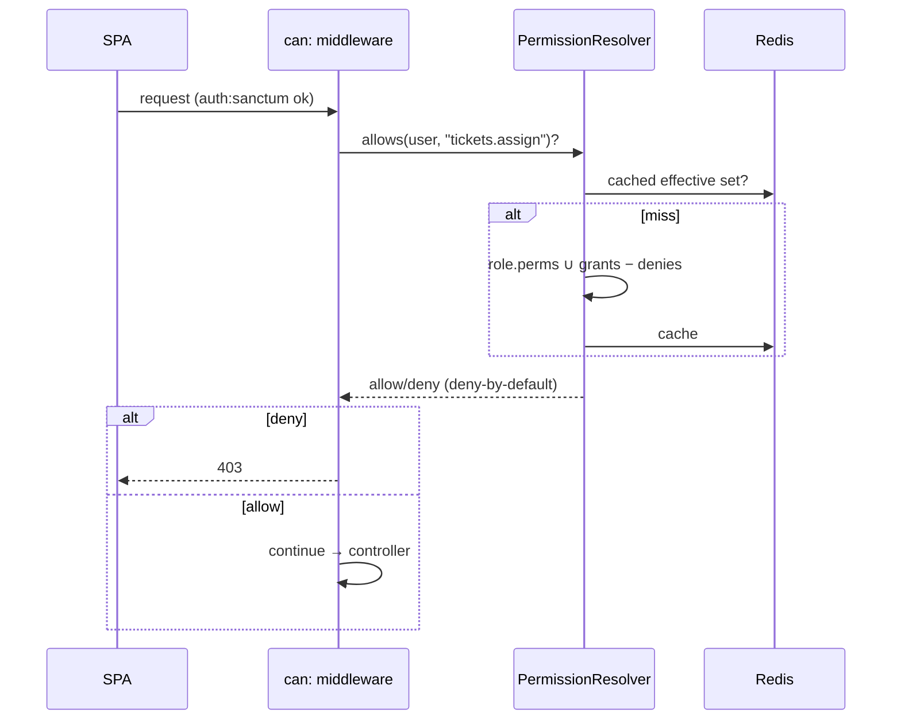
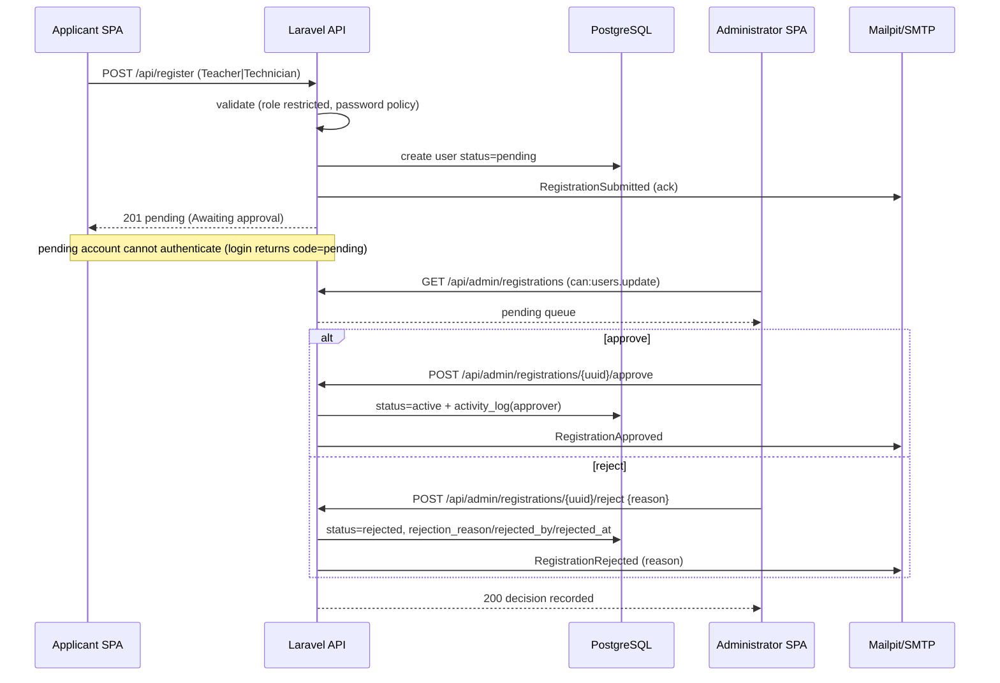
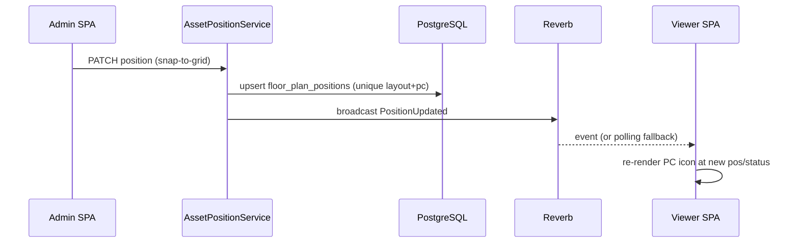
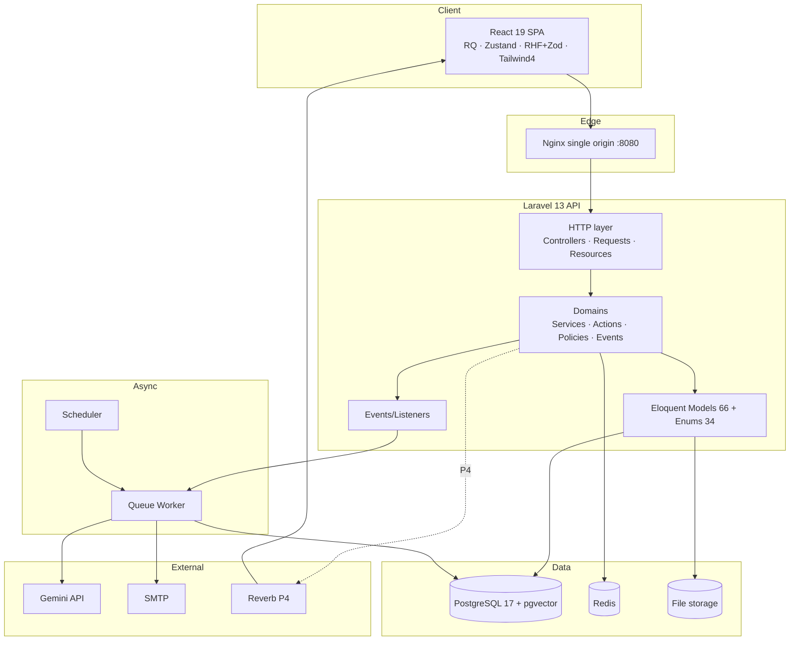
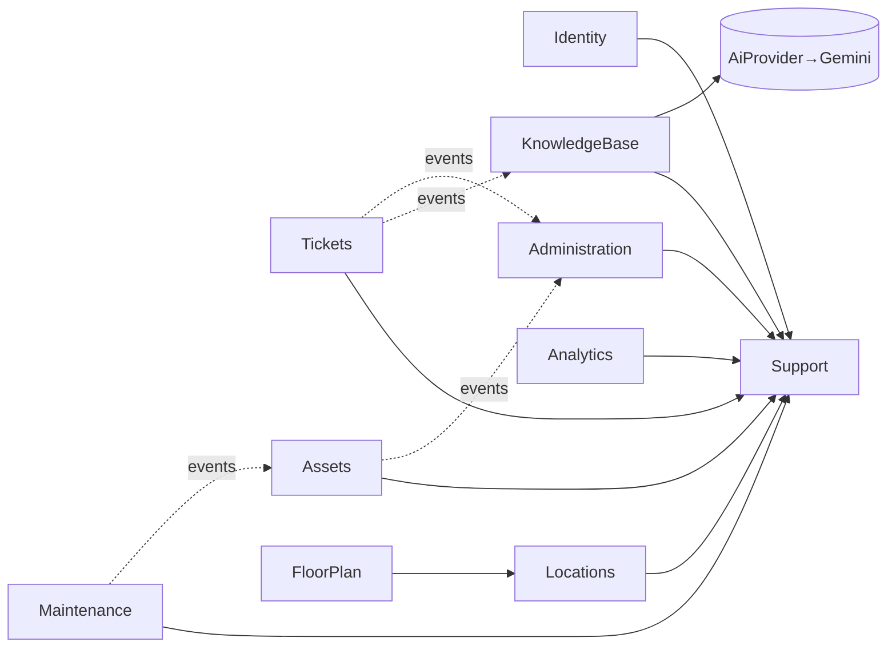
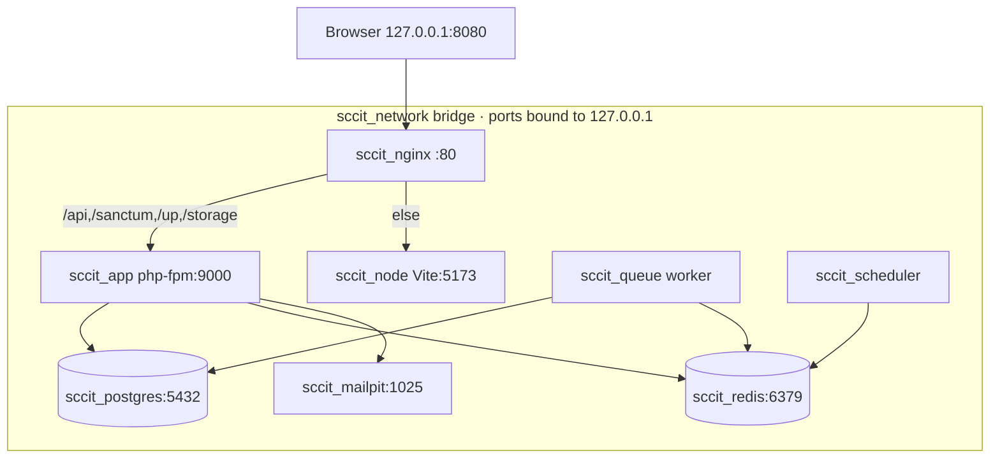
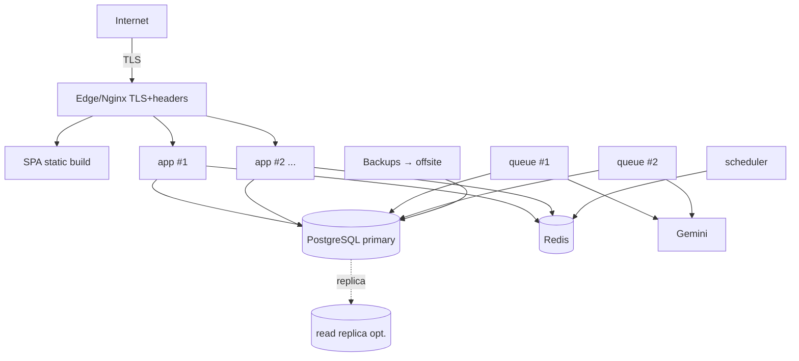

# Software Design Description

**AI-Powered IT Asset & Service Management System — codename “SccIT”**

> **Design authority.** This SDD describes *how* the approved requirements are realized. The **Software Requirements Specification** (SCCIT-SRS v1.0, approved) governs *what* must be built and remains the primary source of truth; this document does not restate requirements — it **references requirement IDs** (`FR-*`, `NFR-*`, `DR-*`, `BR-*`) and shows how the architecture satisfies them. The physical data model in `docs/database/database_design_v2.dbml` (implemented and verified) governs the schema this design builds on. Where design and SRS could diverge, the SRS wins and this document is corrected.

---

## Document Control

| Field | Value |
|---|---|
| Document ID | SCCIT-SDD |
| Version | 1.1 (Approved) |
| Date | 2026-07-04 |
| Standards | IEEE 1016-2009; ISO/IEC/IEEE 42010:2011 |
| Prepared by | Engineering |
| Approved by | Client / Product Owner — approved 2026-07-04 |
| Primary input | SCCIT-SRS v1.1 (**approved**) |
| Related artifacts | `PRODUCT.md`, `DESIGN.md`, `docs/database/database_design_v2.dbml`, `docs/database/database_architecture_report.md`, `docs/PROJECT_STRUCTURE.md`, `docs/ENVIRONMENT.md`, implemented repo (`backend/`, `frontend/`, `docker/`, `compose.yaml`) |

### Revision History

| Version | Date | Author | Summary |
|---|---|---|---|
| 1.0 | 2026-07-03 | Engineering | Initial SDD derived from the approved SRS and the implemented database/scaffold. Includes architecture-review reconciliation (Appendix A) and a design-decision register (§40). |
| 1.0 | 2026-07-03 | Client / Product Owner | Reviewed and approved; baselined as part of the v1.0 project specification (Git tag `v1.0-project-specification`). |
| 1.1 | 2026-07-04 | Engineering | Realizes SRS v1.1 (OI-02 resolved): §10 gains the **registration-request + Administrator-approval** design; §11–12 gain the Identity-domain review flow; new design decisions **DD-17** (registration-request workflow), **DD-18** (dedicated `rejected` status + review columns), **DD-19** (single account-status middleware), **DD-20** (RateLimiter-based lockout & throttling); Appendix A records the OI-02 resolution; §35 adds the registration-approval sequence. |
| 1.1 | 2026-07-04 | Client / Product Owner | Reviewed and approved ahead of Phase 2.2 implementation. |
| 1.2 | 2026-07-05 | Engineering | Realizes SRS v1.2 (Phase 2.3 — User Management). §11–12 gain the User Management design on the existing Identity domain: `UserDirectoryQuery` (server-side search/filter/sort with a sort allow-list), `UserMetrics` (dashboard aggregates), `UserExporter` + maatwebsite/excel (CSV/XLSX), `AccountLockService` + `LoginThrottle` (derive/clear lockout from RateLimiter + `login_history`), `UserGuard` (account-safety invariants), and single-purpose lifecycle Actions. New design decisions **DD-21** (directory query service + sort allow-list), **DD-22** (derived lockout/last-activity + admin unlock), **DD-23** (account-safety invariants in policy + actions), **DD-24** (`EnsurePasswordIsCurrent` force-reset gate), **DD-25** (export via maatwebsite/excel), **DD-26** (field reconciliation — no username/department/location on `users`). All schema changes are additive (SRS DR-016). |
| 1.2 | 2026-07-05 | Client / Product Owner | Reviewed and approved ahead of the Phase 2.3 baseline (Git tag `v2.3-user-management`). |

### Conventions

- **Design element identifiers:** design decisions `DD-nn`; resolved review findings `RES-nn`; extension points `EXT-nn`.
- **Traceability:** each significant design element cites the SRS requirement(s) it satisfies. The consolidated map is [§39](#39-design--requirement-traceability).
- **Diagrams** use Mermaid (renders in Obsidian and GitHub). Where a diagram would add noise, a labelled text diagram is used instead.
- **Status of the codebase:** the **database layer and scaffolding are implemented and verified**; the **application (business-logic) layer is not yet built**. This SDD is therefore *descriptive* for the data layer and established conventions, and *prescriptive* for the application layer to be built in Phase 2+ (consistent with the SRS phasing P2 → P3 → P4).

---

## Table of Contents

1. [Executive Summary](#1-executive-summary)
2. [Design Goals](#2-design-goals)
3. [Overall System Architecture](#3-overall-system-architecture)
4. [Technology Stack](#4-technology-stack)
5. [Deployment Architecture](#5-deployment-architecture)
6. [Laravel Architecture](#6-laravel-architecture)
7. [React Architecture](#7-react-architecture)
8. [PostgreSQL Architecture](#8-postgresql-architecture)
9. [Docker Architecture](#9-docker-architecture)
10. [Authentication Design](#10-authentication-design)
11. [Authorization Design](#11-authorization-design)
12. [RBAC Design](#12-rbac-design)
13. [Database Design Overview](#13-database-design-overview)
14. [Module Architecture](#14-module-architecture)
15. [Component Architecture](#15-component-architecture)
16. [Service Architecture](#16-service-architecture)
17. [API Design](#17-api-design)
18. [Data Flow](#18-data-flow)
19. [Error Handling](#19-error-handling)
20. [Logging Strategy](#20-logging-strategy)
21. [Audit Strategy](#21-audit-strategy)
22. [AI Architecture](#22-ai-architecture)
23. [RAG Architecture](#23-rag-architecture)
24. [QR Architecture](#24-qr-architecture)
25. [Interactive Floor Plan Architecture](#25-interactive-floor-plan-architecture)
26. [Notification Architecture](#26-notification-architecture)
27. [Dashboard Architecture](#27-dashboard-architecture)
28. [Reporting Architecture](#28-reporting-architecture)
29. [Security Architecture](#29-security-architecture)
30. [Performance Design](#30-performance-design)
31. [Scalability Design](#31-scalability-design)
32. [Maintainability Strategy](#32-maintainability-strategy)
33. [Coding Standards](#33-coding-standards)
34. [Package Structure](#34-package-structure)
35. [Sequence Diagrams](#35-sequence-diagrams)
36. [Component Diagrams](#36-component-diagrams)
37. [Deployment Diagrams](#37-deployment-diagrams)
38. [Future Extension Points](#38-future-extension-points)
39. [Design → Requirement Traceability](#39-design--requirement-traceability)
40. [Design Decision Register](#40-design-decision-register)
41. [Appendix A — Architecture Review & Consistency Verification](#appendix-a--architecture-review--consistency-verification)

---

## 1. Executive Summary

SccIT is realized as a **containerized modular monolith**: a single Laravel 13 REST API organized internally by business domain, a React 19 single-page client, and a PostgreSQL 17 database, all served behind a single Nginx origin and supported by Redis (cache/queue/session) and asynchronous workers. The design deliberately favors **one deployable unit with strong internal boundaries** over microservices — appropriate for a single-tenant deployment ([SRS CON-08](#)) and for a team that values maintainability and correctness over distributed-systems overhead.

The architecture is built around four load-bearing ideas:

1. **The database is the last line of defense.** Referential actions, CHECK constraints, partial-unique indexes, counter-cache triggers, and an append-only audit guard are already implemented in PostgreSQL, so application bugs cannot silently corrupt data ([DR-002/005/009/012](#), [NFR-AVL-007](#)).
2. **Domains own vertical slices.** Business logic lives in `App\Domains\<Domain>` (Services + Actions + Eloquent — no repositories), so a new module drops in without restructuring ([NFR-MTN-003](#)).
3. **Opaque identity and deny-by-default authorization.** Every user-facing resource is addressed by `uuid` ([NFR-SEC-001](#)); every request passes an RBAC gate combining role permissions with per-user overrides ([FR-USER-004/005](#)).
4. **Expensive work is asynchronous.** AI analysis, embedding generation, email, and heavy reports run as queued jobs so user requests are never blocked on a slow dependency ([FR-AI-021](#), [NFR-PERF-009](#)), and external providers (Gemini, mail) degrade gracefully ([FR-AI-020](#), [NFR-AVL-005](#)).

The frontend is a feature-sliced SPA using **React Query** for server state, **Zustand** for UI state, **React Hook Form + Zod** for forms, and the **`DESIGN.md` OKLCH token system** wired through Tailwind 4 — delivering the calm, dense “Control Room” experience at WCAG 2.2 AA in both themes ([NFR-USB](#), [NFR-ACC](#)).

This document specifies each of these layers, traces them to the approved requirements, and records the architectural decisions and the review that reconciled the design with the SRS and the implemented database (Appendix A).

---

## 2. Design Goals

Derived from the SRS quality-attribute priorities ([SRS §11.2](#)) and the product/design briefs. In tension, they are resolved in this order: **security & data integrity → accessibility & correctness → availability → performance → feature breadth.**

| ID | Design goal | Driven by |
|---|---|---|
| DG-1 | **Integrity by construction** — invariants enforced at the database, not merely in application code. | DR-002/005/012, NFR-AVL-007, BO-06 |
| DG-2 | **Clear module boundaries** — domain-oriented, low coupling, high cohesion; add modules without refactoring. | NFR-MTN-003, Future Expansion |
| DG-3 | **Secure by default** — opaque IDs, deny-by-default authz, first-party cookie auth, secrets out of client/DB. | §12 SRS, NFR-SEC-* |
| DG-4 | **Responsive under load** — async everything expensive; index every access path; O(1) list reads. | §13–§14 SRS |
| DG-5 | **Accessible, consistent UI** — one design system, role tokens only, dual-theme AA, keyboard-first. | §16 SRS, NFR-USB-* |
| DG-6 | **Graceful degradation** — core workflows survive AI/mail/real-time outages. | FR-AI-020, NFR-AVL-005 |
| DG-7 | **Testable & verifiable** — every layer unit/feature-testable; CI gates green to merge. | NFR-MTN-001/002/005 |
| DG-8 | **Vertical-agnostic** — brand/behavior configurable via settings, zero code change to re-skin. | BO-08, FR-CFG-005 |
| DG-9 | **Observable & recoverable** — structured logs, health endpoints, backups + restore drills. | NFR-OBS-*, NFR-AVL-003/004 |
| DG-10 | **Provider independence for AI** — Gemini behind an abstraction; models swappable via data. | FR-AI-015 |

---

## 3. Overall System Architecture

### 3.1 Architectural style
A **layered, domain-oriented modular monolith** with an **asynchronous work tier**:

- **Presentation:** React 19 SPA (browser).
- **Edge:** Nginx single origin — routes `/api`, `/sanctum`, `/up`, `/storage` to Laravel (php-fpm); everything else to the SPA. First-party cookies, **no CORS**.
- **Application:** Laravel 13 API — HTTP layer (controllers/requests/resources) → domain layer (services/actions) → Eloquent models.
- **Async:** Redis-backed queues driving workers (`queue`) and a scheduler (`scheduler`) for jobs, notifications, AI, embeddings, reports, reminders.
- **Data:** PostgreSQL 17 (+ pgvector) as the system of record; Redis for cache/session/queue; object/file storage for uploads.
- **External:** Google Gemini (AI), SMTP (mail), and — in P4 — Laravel Reverb (WebSockets).

### 3.2 Logical layers (request lifecycle)

```
Browser SPA
  │  fetch (relative /api, cookies)
  ▼
Nginx (single origin :8080) ──/storage,/up──▶ (static / health)
  │  /api, /sanctum → php-fpm
  ▼
Laravel HTTP layer
  Middleware: statefulApi (Sanctum) → auth:sanctum → permission gate → throttle
  Controller (thin) → FormRequest (validate) → Action/Service (domain logic)
        │                                   │
        │                                   ├─▶ Eloquent Models  ──▶ PostgreSQL (FK/CHECK/trigger enforced)
        │                                   ├─▶ dispatch Job ──▶ Redis queue ──▶ Worker (AI/email/embeddings/report)
        │                                   └─▶ fire Event ──▶ Listeners (notify, audit, cache-bust)
        ▼
  API Resource (serialize; uuid, never id) ──▶ JSON response
```

### 3.3 Key architectural properties
- **Statelessness at the app tier** (session/cache in Redis) enables horizontal scaling ([NFR-SCAL-003](#)).
- **Separation of concerns:** controllers are thin; domain logic is in services/actions; persistence is Eloquent; serialization is API Resources.
- **Event-driven cross-domain communication** (events/listeners) keeps domain coupling low ([DG-2](#2-design-goals)).
- **Defense in depth:** validation (FormRequest) → authorization (Policy/Gate) → business rules (Action) → DB constraints (last line).

---

## 4. Technology Stack

Exact versions reflect the implemented repository (`composer.json`, `package.json`, `compose.yaml`, `docker/php/Dockerfile`).

### 4.1 Backend
| Concern | Choice | Notes |
|---|---|---|
| Language/runtime | PHP 8.4 (fpm-bookworm); `require php ^8.3` | `declare(strict_types=1)` everywhere. |
| Framework | Laravel 13 | Slim skeleton; config via `bootstrap/app.php`. |
| Auth | Laravel Sanctum 4 (SPA cookie) | `statefulApi()`; `personal_access_tokens` reserved for future token clients. |
| REPL/tooling | Tinker 3, Pail (logs) | |
| Static analysis | Larastan 3 (level 6) | PHPDoc generics on relations/collections. |
| Formatting | Pint | Laravel preset. |
| Tests | Pest 4 (+ pest-plugin-laravel), PHPUnit 12 | Postgres test DB. |
| PHP extensions | pdo_pgsql, pgsql, bcmath, intl, zip, gd, pcntl, opcache, redis | Baked in the image. |

### 4.2 Frontend
| Concern | Choice | Notes |
|---|---|---|
| Language | TypeScript 6 (strict) | `@` → `src` alias. |
| Framework | React 19.2 | |
| Build | Vite 8 (`@vitejs/plugin-react`) | HMR via Nginx (`clientPort: 8080`), polling watch (Windows/Docker). |
| Routing | react-router-dom 7 | |
| Server state | @tanstack/react-query 5 | `staleTime 30s`, `retry 1`, no refetch-on-focus. |
| UI state | Zustand 5 | e.g. `useUiStore` (theme, layout). |
| HTTP | axios | Single-origin client (`withCredentials`, `withXSRFToken`). |
| Forms/validation | react-hook-form 7 + Zod 4 (`@hookform/resolvers`) | Zod schemas mirror backend validation. |
| Styling | Tailwind CSS 4 (`@tailwindcss/vite`) | `DESIGN.md` OKLCH tokens as theme. |
| Icons | lucide-react | |
| Tests | Vitest 4 + Testing Library + jsdom | |

### 4.3 Data & infrastructure
| Concern | Choice |
|---|---|
| Database | PostgreSQL 17 (`pgvector/pgvector:pg17`) + `pgvector`, `citext`, `pgcrypto` |
| Cache/session/queue | Redis 7 (alpine) |
| Web/edge | Nginx 1.27 (alpine), single origin |
| Mail (dev) | Mailpit; production SMTP configurable |
| Real-time (P4) | Laravel Reverb (WebSockets) — env placeholders present |
| AI (P3) | Google Gemini API (chat + embeddings) |
| Containerization | Docker + Compose (`name: sccit`, `sccit_*` resources) |
| CI | GitHub Actions (Pint, Larastan, Pest; ESLint, Prettier, tsc, Vitest) |

> **Design decision [DD-01].** Modular monolith over microservices — single-tenant scope, one team, correctness/maintainability first. Horizontal scale is achieved by running multiple stateless app containers, not by decomposing services. *(NFR-SCAL-003, DG-2.)*

---

## 5. Deployment Architecture

### 5.1 Topology (current dev stack)
Seven services on one bridge network (`sccit_network`), all host-ports bound to `127.0.0.1` and prefixed `sccit_`:

| Service | Image / build | Role |
|---|---|---|
| `sccit_nginx` | nginx:1.27-alpine | Single-origin edge (`:8080`). |
| `sccit_app` | `docker/php/Dockerfile` (dev target) | php-fpm — Laravel HTTP. |
| `sccit_queue` | same image | `queue:work` worker. |
| `sccit_scheduler` | same image | `schedule:work` loop. |
| `sccit_node` | `docker/node/Dockerfile` | Vite dev server (HMR). |
| `sccit_postgres` | pgvector/pgvector:pg17 | Database. |
| `sccit_redis` | redis:7-alpine | Cache/session/queue. |
| `sccit_mailpit` | axllent/mailpit | Dev mail catcher. |

### 5.2 Production shape (target)
- The **production** Dockerfile stage bakes source + `composer install --no-dev --optimize-autoloader` and `storage:link`; the SPA is built (`vite build`) and served as static assets by Nginx (no Vite/node service in prod).
- **Stateless app tier** behind Nginx/load-balancer; scale `sccit_app` and `sccit_queue` horizontally. Session/cache/queue in Redis makes app containers interchangeable ([NFR-SCAL-003](#)).
- **TLS termination** at the edge; HSTS and security headers ([NFR-SEC-003](#)).
- **Backups** of PostgreSQL (scheduled dumps / PITR) recorded in `backup_history`; restore drills ([NFR-AVL-003/004](#)).
- **Health**: framework `/up` and `/api/health` (DB + Redis) feed orchestrator liveness/readiness ([NFR-OBS-002](#)).

*(Deployment diagram: [§37](#37-deployment-diagrams).)*

---

## 6. Laravel Architecture

### 6.1 Bootstrap & middleware
Laravel 13’s slim skeleton configures the app in `bootstrap/app.php`:
- **Routing:** `web`, `api`, `console`; health at `/up`.
- **Middleware:** `->statefulApi()` enables Sanctum SPA cookie auth on the API group (single-origin, first-party cookies — [DD-04](#40-design-decision-register)).
- **Exceptions:** centralized rendering configured here (see [§19](#19-error-handling)).

### 6.2 Request pipeline (per domain endpoint)
1. **Route** (`routes/api.php`, resourceful, uuid-bound) → controller action.
2. **Middleware:** `auth:sanctum` → **permission gate** (`can:<permission>`) → **throttle** (sensitive routes) ([NFR-SEC-009](#)).
3. **FormRequest** validates + authorizes input (Zod-mirrored rules) ([NFR-SEC-004](#)).
4. **Controller** (thin) delegates to a **Service/Action**.
5. **Action** executes one use case in a DB transaction; mutates via Eloquent; dispatches jobs/events.
6. **API Resource** serializes the result (uuid, computed fields, related data), never leaking numeric ids or non-public settings.

### 6.3 Domain layer (no repositories)
Per the established `app/Domains/README.md`: **Eloquent + Services + Actions**, no repository abstraction (introduced only if a genuine need appears). Each domain owns `Actions/ DTOs/ Enums/ Events/ Jobs/ Listeners/ Models/ Notifications/ Policies/ Services/ Http/{Controllers,Requests,Resources}`. Cross-domain calls prefer **events/listeners** over direct service coupling ([DD-02](#40-design-decision-register)).

### 6.4 Models & shared concerns (implemented)
- **66 Eloquent models** live **flat in `App\Models`** (not per-domain) for zero-friction factory discovery and maintainability across the large model set ([DD-03](#40-design-decision-register)).
- Conventions (verified in `Ticket.php` and siblings): `declare(strict_types=1)`; `use HasFactory, HasUuidRouteKey, SoftDeletes` (where applicable); `$guarded = ['id']`; a `casts()` method mapping enums/dates/decimals; **typed relationship methods with PHPDoc generics** for Larastan.
- **`App\Support\Concerns\HasUuidRouteKey`** auto-fills `uuid` on `creating` and sets `getRouteKeyName() = 'uuid'` — the mechanism behind opaque routing ([NFR-SEC-001](#)).
- **`App\Support\Concerns\HasValues`** gives every string-backed enum `values()`, `names()`, `options()` (value+label) and a default `label()` — the single source for select options exposed to the API/frontend ([DR-004](#), [NFR-MTN-004](#)).
- **34 PHP enums** in `App\Enums` mirror every DB CHECK domain (cast in models).

### 6.5 Providers & wiring
`App\Providers\AppServiceProvider` is the composition root: bind interfaces to implementations (e.g. `AiProvider` → `GeminiProvider`, [DD-11](#40-design-decision-register)), register policies, model observers (blame columns, activity logging), Gates (permission resolution), and morph maps for polymorphic relations (`auditable_*`, `subject_*`, `embeddable_*`).

---

## 7. React Architecture

### 7.1 Structure (feature-sliced)
Cross-cutting building blocks live in top-level `src/` folders (`components/ layouts/ hooks/ contexts/ stores/ services/ types/ utils/ pages/`); each backend domain maps to a self-contained slice under `src/features/<feature>/` (`tickets, assets, maintenance, knowledge-base, analytics, floor-plan`). A slice owns its components, hooks (React Query), API calls, types, and Zod schemas ([DD-13](#40-design-decision-register)).

### 7.2 State management
- **Server state → React Query** (`queryClient`: `staleTime 30s`, `retry 1`, no refetch-on-focus). Query keys are namespaced per feature; mutations invalidate affected keys. This is the cache that keeps list/detail views fast and consistent.
- **UI/client state → Zustand** (`useUiStore` for theme, sidebar, density, command palette). No server data in Zustand.
- **Form state → React Hook Form + Zod**; a shared `zodResolver` bridges validation; schemas mirror backend FormRequest rules so client and server agree.

### 7.3 Networking (single-origin, cookie auth)
`services/api.ts` is the shared axios client: `baseURL '/api'`, `withCredentials`, `withXSRFToken`, `Accept: application/json`, `X-Requested-With`. `initCsrf()` fetches `/sanctum/csrf-cookie` before the first authenticating request. Because the SPA and API share the Nginx origin, cookies are first-party and **no CORS** is needed ([DD-04](#40-design-decision-register)). A response interceptor maps 401 → redirect to login, 403 → forbidden view, 419 → CSRF refresh, and normalizes the error envelope (see [§19](#19-error-handling)).

### 7.4 Design system integration
The `DESIGN.md` OKLCH **role tokens** (`--bg`, `--surface`, `--primary`, status colors, etc., with `[data-theme=dark]` overrides) are the Tailwind 4 theme. Components author against **role tokens only** (never raw OKLCH), giving light/dark parity and the one-token re-brand ([FR-CFG-005](#), [BO-08](#)). Component library encodes the full state set, the 2 px focus ring, tabular figures, status pills, the data table (sort/filter/paginate/density), and teaching empty states ([NFR-USB-002/004/005](#), [NFR-ACC-*](#)).

### 7.5 Routing & code-splitting
`react-router-dom` 7 with role-guarded routes (a route guard reads the authenticated user’s effective permissions). Feature slices are lazy-loaded (route-level `React.lazy`) to keep initial bundle small ([NFR-PERF-003](#)); the future `floor-plan` slice loads its canvas engine only when opened.

### 7.6 Accessibility & performance in the client
Reduced-motion honored via `prefers-reduced-motion`; charts render with non-color encoding and a data-table fallback ([FR-DSH-007](#)); self-hosted fonts/assets (no CDN) for locked-down networks ([NFR-CMP-005](#)); virtualized long lists/tables for dense queues.

---

## 8. PostgreSQL Architecture

The database is **implemented and verified** exactly as specified in `database_design_v2.dbml`; this section describes the design *as built* and how it satisfies the data requirements.

### 8.1 Typing & correctness
`timestamptz` for every datetime (UTC) ([DR-001](#)); `numeric(12,2)` money, `numeric(5,4)` scores; `inet` IPs; `citext` emails (case-insensitive uniqueness); `jsonb` for semi-structured data (settings, audit diffs, AI payloads, widget config) ([DR-013](#)).

### 8.2 Integrity (last line of defense) — implemented
- **Referential actions** on all FKs: RESTRICT (reference/actor), CASCADE (compositions), SET NULL (optional context/audit) ([DR-002](#)).
- **CHECK constraints:** score/probability ∈ [0,1]; non-negative money/quantities; date ordering; geo bounds; hex color; single-target exclusivity (`num_nonnulls`) ([DR-005](#)).
- **Partial-unique indexes** enforcing single-active-row invariants (verified in `create_advanced_db_objects`):
  - `room_layouts_one_active_per_room` — one active layout per room ([FR-FP-001](#)).
  - `technician_assignments_one_active_per_ticket` — one active assignment per ticket ([FR-ASN-002](#), [BR-07](#)).
  - `pc_component_installations_one_active_per_asset` — an asset installed in ≤1 PC ([FR-PC-004](#), [BR-08](#)).
  - `ticket_statuses_single_default` — exactly one default status ([BR-04](#)).
- **Enum domains** as `varchar + CHECK`, mirrored by PHP enums ([DR-004](#)).

### 8.3 Search & AI indexing — implemented
- **Full-text:** generated `search_vector` `tsvector` columns + **GIN** on `tickets(title, description)` and `ai_knowledge_articles(title, problem_signature, verified_solution)` ([FR-TKT-014](#), [FR-AI-005](#)).
- **Vector:** **HNSW** cosine index `ai_embeddings_embedding_hnsw` on `embedding vector(768)` ([FR-AI-007](#), [DR-010](#)).
- **Time-series:** **BRIN** on `audit_logs`, `activity_logs`, `qr_scan_logs` `created_at/scanned_at` ([DR-011](#)).
- **Hot subsets:** partial index `notifications_unread` for unread badges ([FR-NOT-001](#)).

### 8.4 Derived-data triggers — implemented
- **Counter caches** maintained transactionally in the DB (not app-only), so they never drift ([DR-009](#)):
  - `ticket_votes_counter` (INSERT/DELETE → `upvote_count`).
  - `attachments_counter` (INSERT/DELETE → `attachment_count`).
  - `ticket_comments_counter` — **soft-delete aware** (INSERT/UPDATE/DELETE, flips on `deleted_at`).
- **Audit immutability:** `audit_logs_immutable` raises on any UPDATE/DELETE — the tamper-resistance behind [FR-AUD-002](#)/[NFR-SEC-010](#).

### 8.5 Migration ordering (implemented)
Eight per-module create migrations (no FKs) → `add_foreign_keys` (all FKs with explicit actions) → `create_advanced_db_objects` (FTS, HNSW, BRIN, partial indexes, triggers). The framework `create_users_table` was repurposed to framework tables; the real `users` table is created after `roles`. Reproducible via `migrate:fresh` → `rollback` → `migrate` (verified green).

### 8.6 Extensions
`pgvector` (RAG), `citext` (emails), `pgcrypto` (`gen_random_uuid()` default as a safety net behind `HasUuidRouteKey`). Enabled by `docker/postgres/init` and the `enable_postgres_extensions` migration.

---

## 9. Docker Architecture

### 9.1 Multi-stage PHP image (`docker/php/Dockerfile`)
`base` (PHP 8.4-fpm + extensions + Composer + non-root `appuser` + php.ini/www.conf + FPM healthcheck) → `development` (source bind-mounted) and `production` (source + deps baked, `storage:link`). **One image, three runtime roles** — `app` (php-fpm), `queue` (`queue:work --tries=3 --backoff=5 --max-time=3600`), `scheduler` (`schedule:work`) — differing only by command ([DD-10](#40-design-decision-register)).

### 9.2 Single-origin Nginx (`docker/nginx/default.conf`)
`/storage/`, `/api/`, `/sanctum/`, `/up` → php-fpm (`app:9000`); everything else → Vite (`node:5173`) in dev, or static build in prod. `client_max_body_size 50M` (outer limit; the app enforces the configurable per-upload business limit, [FR-TKT-008](#)). Docker embedded DNS resolves `node` at request time; dotfiles denied. No CORS — first-party Sanctum cookies ([DD-04](#40-design-decision-register)).

### 9.3 Node/Vite (dev only)
`docker/node/Dockerfile`; named volume isolates Linux `node_modules` from the Windows host; HMR dials back through `:8080`; polling watch for Docker-on-Windows FS events.

### 9.4 Operational conventions
All host ports bound to `127.0.0.1` (not LAN-exposed); healthchecks on postgres/redis/nginx gate `depends_on`; named volumes for pg/redis/mailpit/node_modules; `sccit_` prefix and `sccit_network` isolate the stack.

---

## 10. Authentication Design

Realizes [FR-AUTH-001..016](#) and [NFR-SEC-003/009](#).

### 10.1 Mechanism — Sanctum SPA cookie auth
- Enabled by `statefulApi()` in `bootstrap/app.php`; the SPA and API share the Nginx origin, so the session cookie is **first-party** and CSRF-protected — no bearer tokens in JS, no CORS ([DD-04](#40-design-decision-register)).
- **Flow:** SPA calls `GET /sanctum/csrf-cookie` (`initCsrf()`) → `POST /api/login` with credentials → Laravel creates a session; subsequent requests carry the session cookie + `X-XSRF-TOKEN` (axios `withXSRFToken`). `GET /api/user` (guarded by `auth:sanctum`) returns the authenticated principal. Logout invalidates the session server-side.
- **Session store:** configurable driver; production uses **Redis** for statelessness across app containers ([NFR-SCAL-003](#)); the `sessions` table exists as a database-driver alternative.
- `personal_access_tokens` (Sanctum) is reserved for future programmatic/API clients ([EXT-06](#38-future-extension-points)); not used by the SPA.

### 10.2 Credential & session policy
- Passwords hashed with bcrypt/argon2 ([FR-AUTH-002](#)); password policy enforced in a `Password` rule ([FR-AUTH-003](#)).
- **Lockout:** a login throttle + failed-attempt counter locks the account after N (default 5) failures for a window (default 15 min), writing `login_history` (`success/failed/locked_out`) and emailing the user ([FR-AUTH-005/006](#)).
- **Idle expiry** (default 8 h) and explicit logout; login **regenerates** the session (fixation defense) and logout **invalidates** the session and **regenerates the CSRF token**; password change re-auth invalidates other sessions ([FR-AUTH-009/010/011](#)).
- **Reset** via single-use, time-limited `password_reset_tokens` ([FR-AUTH-008](#)); a custom notification builds the SPA reset URL (`/reset-password?token=…&email=…`).
- **Status gate:** only `active` users authenticate. Credentials are verified **first**; invalid credentials return a non-disclosing error, while valid credentials on a non-active account return a **status-specific** response (`pending`/`rejected`/`suspended`/`inactive`) so a legitimate applicant learns their registration outcome ([FR-AUTH-004](#); [DD-19](#40-design-decision-register)).
- **Lockout & throttling** use Laravel's Redis-backed `RateLimiter` keyed by email+IP — no schema change ([DD-20](#40-design-decision-register); [FR-AUTH-006](#), [NFR-SEC-009](#)).
- **MFA (TOTP)** is a reserved extension ([FR-AUTH-012](#), [EXT-05](#38-future-extension-points)) — not in P2.

### 10.3 Registration-request & approval ([FR-AUTH-013..016](#), [BR-01a](#); [DD-17](#40-design-decision-register)/[DD-18](#40-design-decision-register))
- **Public request:** `POST /api/register` accepts a Teacher or Technician application (role restricted; Administrator never self-registerable). A `RegisterApplicant` action creates the `users` row with `status = pending`; the applicant **cannot authenticate** until approved. The applicant receives an acknowledgement (and may re-check by attempting sign-in, which returns the `pending` status).
- **Administrator review:** `App\Domains\Identity` exposes an approval queue (`GET /api/admin/registrations`, permission `users.update`). `ApproveRegistration` sets `status = active` (recording actor/time in `activity_logs`); `RejectRegistration` sets `status = rejected` and persists `rejection_reason`, `rejected_by`, `rejected_at`.
- **Notifications:** approval and rejection both email the applicant ([FR-AUTH-015](#)); rejection includes the reason when present. Auth emails are sent synchronously for reliable local delivery (Mailpit) and can be queued later.
- **Account-status enforcement** is centralized in a single `EnsureAccountIsActive` middleware ([FR-AUTH-016](#); [DD-19](#40-design-decision-register)) — the one source of truth for `pending/rejected/suspended/inactive` on authenticated requests; controllers never re-check status.

*(Login sequence: [§35.1](#351-authentication-sanctum-spa-login); registration-approval sequence: [§35.6](#356-registration-request--approval).)*

---

## 11. Authorization Design

Realizes [FR-USER-004/005](#), [NFR-SEC-002](#) (deny-by-default).

### 11.1 Enforcement points (defense in depth)
1. **Route middleware** `auth:sanctum` (identity) + `can:<permission>` (capability).
2. **Policies** (`App\Domains\<Domain>\Policies`) for per-record decisions (e.g. a Teacher may view only tickets they reported — [FR-TKT-013](#)).
3. **FormRequest `authorize()`** for input-scoped checks.
4. **API Resources** withhold fields the caller may not see (e.g. `is_internal` comments, non-public settings — [FR-TKT-007](#), [NFR-SEC-006](#)).

### 11.2 Effective-permission resolution
A `PermissionResolver` (registered as a Gate `before`/ability callback) computes a user’s **effective permission set**:

```
effective = (role.permissions)              // via role_permissions
            ∪ (user_permissions WHERE grant) // explicit grants
            − (user_permissions WHERE deny)  // explicit denies win
```

Deny overrides grant; unknown permission ⇒ deny (deny-by-default). The set is cached per user in Redis and invalidated on any role/permission change (which is also audited, [NFR-SEC-017](#)).

---

## 12. RBAC Design

Realizes [§8 SRS](#) roles and [FR-USER-001..010](#), on the implemented tables `roles`, `permissions`, `role_permissions`, `user_permissions`.

### 12.1 Model
- **Roles** (`is_system`: Administrator, Technician, Teacher — non-deletable, [BR-01](#)); one role per user (`users.role_id`) ([BR-02](#); multi-role is [SRS OI-01](#)/[EXT-04](#38-future-extension-points)).
- **Permissions** as `module.action` (e.g. `tickets.assign`, `system.settings.manage`) grouped by `module`; seeded matrix is the tested baseline ([SRS §8.4](#)).
- **role_permissions** (M:N) assigns capability to a role; **user_permissions** overrides per user with `grant_type` grant/deny.

### 12.2 Administration
Administrators (`roles.manage`, `users.*`) adjust role permissions and per-user overrides at runtime ([FR-USER-010](#)); changes emit audit entries. The permission catalog is data, so new capabilities are added by seeding new `module.action` rows — no code change to the RBAC engine.

### 12.3 Frontend mirror
The SPA fetches the user’s effective permissions after login and gates navigation/actions client-side **for UX only**; the server remains the authority (client checks never replace server checks — [NFR-SEC-002](#)).

---

## 13. Database Design Overview

The full schema, rationale, and per-table notes are authoritative in `database_design_v2.dbml` and the Database Architecture Report; this SDD **does not restate them**. Design-relevant summary:

- **8 logical modules** (Identity/Access; Locations & Floor Plan; Computers & QR; Ticketing; Maintenance; Inventory & Assets; AI/RAG; Administration/System) map onto the backend domains ([§14](#14-module-architecture)).
- **Surrogate `bigint` PKs** internally; **external `uuid`** on user-facing entities for routing ([NFR-SEC-001](#)).
- **Soft deletes** on business/master entities; **never** on logs/history/pivots ([DR-007](#)).
- **Blame columns** (`created_by`/`updated_by`) via model observers ([DR-008](#)).
- **Lifecycle/history tables** (`ticket_status_history`, `asset_status_history`, `stock_transactions`, `pc_component_installations`) provide the event streams that power reporting ([FR-RPT-005](#)).
- **Denormalized read snapshots** documented with their source of truth: ticket counters (triggers), `pc_specifications` (vs `pc_component_installations`), `tickets.ai_*` (vs `ai_analysis_logs`) ([DR-009](#)).

*(Data model → module → requirement map: [SRS §29.1/§30.2](#).)*

---

## 14. Module Architecture

### 14.1 Domain map
Six domain **seams exist** in the repo; the design adds two P2 domains for identity and administration (the modular-monolith structure explicitly supports adding modules without restructuring). QR lives under **Assets** and assignment/repair under **Tickets**, per `app/Domains/README.md`.

| Domain | Status | Responsibility (SRS modules) | Key requirements |
|---|---|---|---|
| **Identity** | *new (P2)* | Auth, **registration-request + approval**, users, roles, permissions, sessions/login history, account-status enforcement. | FR-AUTH-*, FR-USER-* |
| **Locations** | *new (P2)* | Buildings, floors, rooms CRUD (foundation for FloorPlan). | FR-LOC-* |
| **Tickets** | seam | Tickets, comments, votes, attachments, tags, status/SLA, **technician assignment**, ticket AI snapshot. | FR-TKT-*, FR-ASN-* |
| **Assets** | seam | PC units, specs, **QR**, catalog, serialized assets, consumables, stock, procurement, transfers, disposal. | FR-PC-*, FR-QR-*, FR-AST-* |
| **Maintenance** | seam | Corrective + preventive maintenance, checklists, images, notes, hardware replacements. | FR-MNT-* |
| **KnowledgeBase** | seam | AI triage/chat, RAG knowledge base, embeddings, feedback, predictions (opt-in). | FR-AI-* |
| **Analytics** | seam | Dashboards, KPIs, reports, exports. | FR-DSH-*, FR-RPT-* |
| **Administration** | *new (P2)* | System settings/branding, notifications & preferences, announcements, audit/activity, maintenance windows, backup. | FR-CFG-*, FR-NOT-*, FR-AUD-* |
| **FloorPlan** | seam (P4) | Interactive layout/positions, real-time, info panels. | FR-FP-* |

> **Resolved finding [RES-01].** `app/Domains/FloorPlan/README.md` lists `BuildingService`/`FloorService` under FloorPlan, but location CRUD is **P2** ([FR-LOC](#)) while the floor plan is **P4** ([FR-FP](#)). Resolution: basic Building/Floor/Room CRUD moves to a **Locations** domain (P2); FloorPlan (P4) keeps the *visual/spatial* services (`RoomLayoutService`, `AssetPositionService`, `CoordinateService`, `FloorPlanService`) that build on Locations. No requirement changes. *(See Appendix A.)*

### 14.2 Inter-domain communication
Domains communicate via **events/listeners** (e.g. `TicketResolved` → KnowledgeBase listener drafts an article when enabled; `MaintenanceCompleted` → Assets updates installation history; `StockChanged` → Administration raises a low-stock notification). Direct service-to-service calls are avoided across domains to preserve boundaries ([DG-2](#2-design-goals)).

---

## 15. Component Architecture

### 15.1 Backend components (per domain)
- **Controller** — thin HTTP adapter; one resourceful controller per aggregate; delegates to actions.
- **FormRequest** — validation + `authorize()`.
- **Action** — a single use case (`CreateTicket`, `AssignTechnician`, `CompleteMaintenance`, `RecordStockTransaction`), transactional, returns a DTO/model.
- **Service** — orchestration spanning multiple actions/aggregates (`SlaService`, `TicketTriageService`, `RagService`).
- **DTO** — typed data crossing boundaries (request → action, provider responses).
- **Policy** — per-record authorization.
- **Event/Listener** — cross-domain side effects.
- **Job** — async unit (AI analysis, embedding, email, report build).
- **Notification** — Laravel notification (database + mail channels).
- **API Resource** — serialization.
- **Model + Observer** — persistence + blame/activity hooks.

### 15.2 Frontend components (per feature slice)
- **Route/page** (lazy-loaded), **feature components** (lists, detail panels, forms), **hooks** (`useTicketsQuery`, `useAssignTechnicianMutation`), **api** (typed axios calls), **schema** (Zod), **types** (mirroring API resources).
- **Shared** components (`components/`): DataTable, StatusPill, FormField, CommandPalette, Toast, EmptyState, ChartKit — all design-system-conformant.

*(Component diagram: [§36](#36-component-diagrams).)*

---

## 16. Service Architecture

Representative domain services and the requirements they realize:

| Service | Responsibility | Realizes |
|---|---|---|
| `AuthService` | Login/logout, lockout, reset, session lifecycle (regenerate/invalidate). | FR-AUTH-001..011 |
| `RegisterApplicant` / `ApproveRegistration` / `RejectRegistration` (actions) | Registration-request creation and Administrator approve/reject with reason + emails. | FR-AUTH-013..016, BR-01a |
| `AuditLogger` | Reusable writer for `login_history` (auth attempts) and `activity_logs` (account/password lifecycle events); consumed by future modules. | FR-AUTH-005, FR-AUD-*, NFR-SEC-017 |
| `PermissionResolver` | Effective-permission computation + cache. | FR-USER-004/005 |
| `TicketService` / actions | Create, transition, assign, comment, vote, duplicate. | FR-TKT-* |
| `SlaService` | Derive `*_due_at` from priority; detect breach; emit events. | FR-TKT-004/017, BR-05 |
| `AssignmentService` | Assignment lifecycle, one-active enforcement (DB-backed). | FR-ASN-* |
| `MaintenanceService` | Records, checklists, replacements, PM scheduling/reminders. | FR-MNT-* |
| `InventoryService` | Stock ledger, quantity invariants, reorder alerts. | FR-AST-003/004/010 |
| `AssetLifecycleService` | Status history, transfers, disposal. | FR-AST-002/005/006/007 |
| `ProcurementService` | Request → approval workflow. | FR-AST-008/009 |
| `QrService` | Generate/print, verify, scan classification. | FR-QR-* |
| `TriageService` / `RagService` / `AiProvider` | AI analysis, retrieval, provider calls. | FR-AI-* |
| `NotificationService` | Multi-channel dispatch honoring preferences. | FR-NOT-* |
| `SettingsService` | Typed settings read/write, public gating, cache. | FR-CFG-* |
| `ReportingService` | Aggregate queries, exports. | FR-RPT-* |
| `AuditService` (observers) | Row diffs + activity logging. | FR-AUD-* |

Actions are the transactional workhorses; services orchestrate. All expensive/external work is dispatched to jobs ([§18](#18-data-flow)).

---

## 17. API Design

Realizes [SRS §24.2 EIF-API](#).

### 17.1 Principles
- **REST under `/api`**, JSON, versioned (`/api/v1`), authenticated by Sanctum session cookie.
- **uuid addressing** for user-facing resources; numeric ids never appear in payloads or URLs ([NFR-SEC-001](#), [EIF-API-002](#)).
- **Resourceful routes** with nested sub-resources where they are compositions (e.g. `/tickets/{ticket}/comments`).
- **Consistent envelope:** success `{ data, meta? }`; errors `{ message, errors?, code }` (see [§19](#19-error-handling)).
- **Pagination/filtering/sorting** conventions: `?page`, `?per_page`, `?sort=-created_at`, `?filter[status]=open`; list endpoints back the SPA’s React Query hooks.
- **Documentation:** OpenAPI kept in sync ([NFR-MTN-006](#), [EIF-API-004](#)).

### 17.2 Representative endpoints (illustrative)
```
POST   /api/login                      GET  /api/user           POST /api/logout
GET    /api/tickets?filter&sort&page   POST /api/tickets
GET    /api/tickets/{uuid}             PATCH /api/tickets/{uuid}
POST   /api/tickets/{uuid}/comments    POST /api/tickets/{uuid}/votes
POST   /api/tickets/{uuid}/assignments PATCH /api/assignments/{uuid}
GET    /api/pc-units/{uuid}            POST /api/qr/{code}/scan
GET    /api/assets  /consumables  /procurement-requests
POST   /api/ai/tickets/{uuid}/analyze  POST /api/ai/assistant/messages
GET    /api/dashboard/widgets          GET  /api/reports/{key}/export
GET    /api/settings (public subset)   PATCH /api/settings (admin)
GET    /api/notifications              POST /api/notifications/read
```
Each route carries `can:<permission>`; write routes on sensitive resources are throttled.

---

## 18. Data Flow

### 18.1 Synchronous write (e.g. create ticket)
Controller → FormRequest (validate) → Action (transaction: insert ticket, set reporter, derive SLA due times, stamp default status, write status history) → commit → fire `TicketCreated` → API Resource → JSON. DB triggers keep counters correct; observers write blame/audit. *(Sequence: [§35.2](#352-ticket-creation--async-ai-analysis).)*

### 18.2 Asynchronous work (Redis queue)
`TicketCreated` listener dispatches `AnalyzeTicketJob` → worker calls `AiProvider` (Gemini) → writes `ai_analysis_logs` + `ai_recommendations`, updates the ticket’s `ai_summary/ai_confidence` snapshot, and (if a knowledge source changed) enqueues `GenerateEmbeddingJob`. Email and heavy report builds are likewise queued. Jobs are **idempotent and retriable** ([NFR-AVL-006](#)); failures are captured ([NFR-OBS-004](#)).

### 18.3 Scheduled work
`schedule:work` drives: preventive-maintenance due detection + reminders ([FR-MNT-007](#)), SLA-breach sweeps ([FR-TKT-017](#)), embedding staleness reindex ([FR-AI-006](#)), daily notification digests ([FR-NOT-008](#)), backups + log retention pruning ([NFR-AVL-003](#), [NFR-SEC-015](#)).

### 18.4 Read path
SPA React Query hook → `/api` list/detail → Resource. Hot aggregates (dashboard KPIs) are served from counter caches / cached aggregates, not live full-table scans ([NFR-PERF-008](#)).

---

## 19. Error Handling

Realizes robust, non-leaking behavior ([NFR-SEC](#), [NFR-AVL-005](#)).

### 19.1 Backend
- Centralized exception handling in `bootstrap/app.php` `withExceptions`. Map: `ValidationException` → 422 `{message, errors}`; `AuthenticationException` → 401; `AuthorizationException` → 403; `ModelNotFoundException`/404 → 404; `ThrottleRequests` → 429; unhandled → 500 with a correlation id and **no stack trace/PII in production** ([NFR-SEC](#)).
- **Domain exceptions** (`DomainException` subclasses, e.g. `StockWouldGoNegative`, `AssignmentAlreadyActive`) map to 409/422 with a stable machine `code`. DB constraint violations (unique/partial-unique/CHECK) are caught and translated to the same domain errors so the DB’s last-line defense surfaces as a clean API error, never a 500.
- **External calls** (Gemini, mail) wrapped with timeouts + retry/backoff; failures degrade gracefully and are logged, never blocking the core request ([FR-AI-022](#), [NFR-AVL-005](#)).

### 19.2 Frontend
Axios interceptor normalizes errors: 401 → login, 403 → forbidden, 419 → refresh CSRF & retry once, 422 → bind field errors into React Hook Form, 429/5xx → toast with retry. Mutations surface optimistic-rollback on failure; React Query `retry: 1` covers transient reads.

---

## 20. Logging Strategy

Realizes [NFR-OBS-*](#).

- **Structured application logs** (JSON) with a per-request **correlation id** propagated to jobs and external-provider calls ([NFR-OBS-001](#)); channels via Laravel logging (stderr in containers → aggregator).
- **Levels:** request/route (info), domain events (info), handled domain errors (warning), unhandled (error), security events (login, lockout, permission change → dedicated channel).
- **AI observability:** every provider call records `prompt_tokens`, `completion_tokens`, `latency_ms` on the analysis/conversation rows ([NFR-OBS-003](#), [FR-AI](#)).
- **Job failures** captured in the failed-jobs store; retriable ([NFR-OBS-004](#)).
- **Dev logs** streamed via Pail.
- **Boundary vs. audit:** application logs are for operators/debugging (transient, prunable); they are **distinct** from the two durable, user-attributable trails in [§21](#21-audit-strategy).

---

## 21. Audit Strategy

Realizes [FR-AUD-001..004](#), [NFR-SEC-010/017](#), [BO-06](#). Two complementary, first-class trails (a deliberate, documented split — not duplication):

| Trail | Table | Captures | Integrity |
|---|---|---|---|
| **Row-level change audit** | `audit_logs` | create/update/delete/restore with actor + `jsonb` old/new diffs (polymorphic `auditable_*`). | **Append-only, DB-enforced** via `audit_logs_immutable` trigger — no UPDATE/DELETE possible. BRIN on `created_at`. |
| **Application activity log** | `activity_logs` | who did what, in which module, on which subject (`subject_*`), with IP/user-agent. | Append-only (app), BRIN on `created_at`. |

- **Capture mechanism:** a shared **Auditable observer** writes `audit_logs` on model events for business entities; an **activity** helper records higher-level actions from services. Blame columns (`created_by`/`updated_by`) are set by the same observer.
- **Access:** searchable/filterable by Administrators with `system.audit.view` ([FR-AUD-004](#)); write access to audit is impossible even for admins ([NFR-SEC-010](#)).
- **Privilege changes** (role/permission grant/deny) are always audited with before/after ([NFR-SEC-017](#)).

---

## 22. AI Architecture

Realizes [SRS §17](#) (P3). Conservative by default: predictions/learning/auto-articles ship **disabled** ([SRS §17.2](#), [CON-07](#)).

### 22.1 Provider abstraction
An `AiProvider` interface (`chat()`, `embed()`) is bound to a `GeminiProvider` in the service provider ([DD-11](#40-design-decision-register)). Model selection is **data-driven** via `ai_models` (chat: Gemini 1.5 Flash; embedding: text-embedding-004/768) and the `ai_system_settings` singleton (active/embedding model, `confidence_threshold` 0.70, feature toggles). Swapping providers/models requires no code change ([FR-AI-014/015](#)).

### 22.2 Triage pipeline (async)
`AnalyzeTicketJob` builds a minimized, PII-redacted prompt ([FR-AI-030](#)), retrieves RAG context ([§23](#23-rag-architecture)), calls `chat()`, and persists `ai_analysis_logs` (category, severity, est. minutes, `technician_required`, confidence, summary) + ordered `ai_recommendations`; it updates the ticket’s `ai_summary/ai_confidence` snapshot. Runs on the queue so the UI never blocks ([FR-AI-021](#)).

### 22.3 Safety & governance
- **Advisory only:** AI never performs irreversible/state-changing actions; below `confidence_threshold` output is clearly advisory ([FR-AI-010/032](#), [BR-15](#)).
- **Labeling:** AI-generated content is labelled in the UI ([FR-AI-031](#)).
- **Data minimization/redaction** before any external call; logs held under the same retention/access as other PII ([FR-AI-030/034](#), [NFR-SEC-013](#)).
- **Graceful degradation:** provider down ⇒ AI panels show unavailable, core workflows unaffected, jobs retry on recovery ([FR-AI-020/022](#)).
- **Feedback loop:** `ai_feedback` (helpful/rating/text, one per user per recommendation) feeds quality metrics ([FR-AI-008](#)).

### 22.4 Predictive maintenance (opt-in)
When enabled, `ai_learning_events` feed pattern detection into `ai_failure_patterns` and per-PC `ai_predictions`; surfaced on the PC info panel and (P4) the floor plan ([FR-AI-011/012](#)).

*(Assistant sequence: [§35.3](#353-rag-assistant-query).)*

---

## 23. RAG Architecture

Realizes [FR-AI-005/006/007](#), [DR-010](#).

### 23.1 Indexing pipeline (decoupled)
`ai_embedding_sources` tracks *what* needs (re)indexing per source (`ticket`, `ticket_comment`, `maintenance_record`, `knowledge_article`) and model, with status (`pending/processing/indexed/failed/stale`) and a `content_hash` for staleness detection. On content change, a source row is marked stale; `GenerateEmbeddingJob` chunks the text, calls `embed()`, and writes `ai_embeddings` (768-dim `vector`, `chunk_index`, `content`, `content_hash`, `token_count`). The vector store is deliberately **separate from OLTP** so retrieval scales independently ([NFR-SCAL-005](#)).

### 23.2 Retrieval
`RagService` embeds the query, runs an **HNSW cosine** top-k search (`ai_embeddings_embedding_hnsw`) filtered to `indexed` published sources, assembles grounded context, and passes it to `chat()`. Responses **cite the source records** used ([FR-AI-007](#)). Vector search target ≤ 300 ms for k ≤ 10 ([NFR-PERF-006](#)).

### 23.3 Knowledge base
`ai_knowledge_articles` (draft/published/archived) carries the generated FTS `search_vector` (GIN) for keyword search and is an embedding source for semantic search; only **published** articles are visible to Teachers ([FR-AI-005](#)).

---

## 24. QR Architecture

Realizes [SRS §18](#).

- **Model:** `qr_codes` binds **exactly one** target (`num_nonnulls(pc_unit_id, asset_id)=1`, DB-enforced) with a unique canonical `code`; `pc_units.qr_identifier` is a synced convenience copy ([FR-QR-001/002](#), [BR-09](#)).
- **Generation:** `QrService` renders a printable image at configured size/error-correction (`qr.default_size` 256, `qr.error_correction` M) ([FR-QR-003](#)).
- **Scan/verify:** `POST /api/qr/{code}/scan` resolves the target and returns its live info panel; every scan is logged to `qr_scan_logs` (result, scanner, IP, optional geo with bounds CHECK). Result classification is deterministic ([FR-QR-006](#)):
  - `success` — active code, resolvable live target.
  - `invalid` — unknown code.
  - `mismatch` — resolves but points elsewhere/moved.
  - `expired` — code `inactive/revoked` **or** target `retired/disposed` (status-based; no date field — [SRS OI-04](#)/[RES-04](#)).
- **QR-initiated maintenance:** a scan may attach/start a maintenance record (`qr_scan_logs.maintenance_record_id`) ([FR-QR-008](#)).
- **Client:** browser camera, no native app ([FR-QR-009](#)).

*(Scan sequence: [§35.4](#354-qr-scan-verification).)*

---

## 25. Interactive Floor Plan Architecture

Realizes [SRS §19](#) (**P4**). Data/seams exist; no logic yet.

- **Domain:** `FloorPlan` builds on the P2 **Locations** domain ([RES-01](#)). Services: `RoomLayoutService` (versioned layouts; one active per room, DB-enforced), `AssetPositionService` (positions in `floor_plan_positions`, unique per layout+PC, coords ≥ 0), `CoordinateService` (snap-to-grid/rotation/z-index math), `FloorPlanService` (orchestration).
- **Rendering:** SPA canvas (lazy-loaded engine) with pan/zoom; PC icons colored by `pc_units.status` using the universal status palette **plus label/shape** for color-blind safety ([FR-FP-004](#), [NFR-ACC-004](#)); click opens the PC info panel (specs, installed hardware, QR, ticket/maintenance history, AI predictions) ([FR-FP-005](#)).
- **Editing:** Administrator-only (`floorplan.manage`); drag-drop + snap persist to `floor_plan_positions`. A **keyboard/non-drag alternative** meets WCAG 2.2 dragging criteria ([FR-FP-009](#), [NFR-ACC-008](#)).
- **Real-time:** Laravel **Reverb** broadcasts position/status changes to viewers; **polling fallback** if WebSockets are unavailable ([FR-FP-007](#), [DD-16](#40-design-decision-register)).
- **Versioning:** position history preserved across layout versions; a PC may move rooms without data loss ([FR-FP-008](#)).

*(Real-time update sequence: [§35.7](#357-real-time-floor-plan-update-p4).)*

---

## 26. Notification Architecture

Realizes [SRS §22](#).

- **Delivery:** Laravel Notifications with two channels — **database** (`notifications` table → in-app center, unread badge from the `notifications_unread` partial index) and **mail** ([FR-NOT-001/002/006](#)).
- **Preferences:** `NotificationService` honors per-user, per-type channel preferences (`notification_preferences`, unique per user+channel+type) before dispatch ([FR-NOT-002](#)).
- **Triggers** (fired via domain events): assignment/reassignment, status change, new comment, SLA breach/nearing, maintenance scheduled/due, low-stock reorder, procurement decision, account lockout, new announcement ([FR-NOT-003](#)).
- **Digest:** a scheduled job aggregates unread items into a daily email when enabled ([FR-NOT-008](#)).
- **Announcements:** Administrators publish audience-targeted, time-boxed, pinnable announcements shown to the targeted audience ([FR-NOT-010/011](#)).
- **Real-time push:** P4 via Reverb, with polling fallback ([FR-NOT-007](#)).

---

## 27. Dashboard Architecture

Realizes [SRS §20](#).

- **Widget model:** `dashboard_widgets` (per-user layout; `user_id NULL` = global default) with typed widgets (counter/line/bar/pie/table/list/map/timeline/gauge) and `jsonb` configuration ([FR-DSH-002](#)).
- **Role-aware default dashboards:** Admin (backlog, tickets by status/priority/category, SLA compliance/breaches, MTTR/FRT, technician workload, assets by status, low-stock, upcoming PM), Technician (assigned/active, nearing-breach, scheduled maintenance), Teacher (my tickets, quick actions) ([FR-DSH-003/004](#)).
- **Fast KPIs:** widgets read from counter caches / cached aggregates (Redis, short TTL) or pre-aggregated queries, meeting ≤ 1 s ([FR-DSH-005](#), [NFR-PERF-008](#)).
- **Accessible charts:** a `ChartKit` renders with labels/legends, non-color encoding, and a data-table fallback ([FR-DSH-007](#)); palettes follow the project data-viz guidance, consistent light/dark.

---

## 28. Reporting Architecture

Realizes [SRS §21](#).

- **On-demand reports (P2):** `ReportingService` computes metrics from **authoritative history/lifecycle tables** (`ticket_status_history`, `asset_status_history`, `stock_transactions`, maintenance records) and ticket lifecycle timestamps ([FR-RPT-005](#)) — never from mutable snapshots.
- **Timezone-correct bucketing** using `timestamptz` ([FR-RPT-002](#), [DR-001](#)).
- **Filters:** date range, building/floor/room, category/priority/status, technician, asset attributes.
- **Export:** CSV/PDF/(XLSX) reflecting active filters; large exports run as **queued jobs** with a download link on completion ([FR-RPT-004](#), [NFR-PERF](#)).
- **Authorization:** `reports.view` / `reports.export` ([FR-RPT-003](#)).
- **Future:** materialized views for heavy aggregates and saved/scheduled reports (`report_definitions`/`scheduled_reports`) are reserved ([FR-RPT-006/007](#), [EXT-03](#38-future-extension-points)) — **not** in the current schema.

---

## 29. Security Architecture

Realizes [SRS §12](#). Defense in depth across the stack:

| Layer | Control | Requirement |
|---|---|---|
| Edge | TLS/HSTS, security headers (CSP, X-Content-Type-Options, frame-ancestors), dotfile deny, body-size cap. | NFR-SEC-003 |
| Identity | First-party Sanctum cookie, CSRF, lockout, password policy. | FR-AUTH-*, NFR-SEC-009 |
| Access | Deny-by-default RBAC + per-user overrides; policies; resource field-gating. | NFR-SEC-002, FR-USER-004/005 |
| Objects | uuid-only external identifiers (no IDOR/enumeration). | NFR-SEC-001 |
| Input | Server-side validation (FormRequest); parameterized queries only. | NFR-SEC-004 |
| Output | Escaping/encoding of user content (XSS); API Resources withhold internals. | NFR-SEC-014, NFR-SEC-006 |
| Files | Stored outside web root; MIME/size allow-list; SHA-256 checksum; (AV scan reserved). | NFR-SEC-007/008 |
| Secrets | Env/secret store only; `is_public` gates settings exposure. | NFR-SEC-005/006 |
| Audit | DB-enforced append-only trail; privilege-change logging. | NFR-SEC-010/017 |
| Data | PII concentrated + soft-deletable + lawful hard-purge; log retention/pruning. | NFR-SEC-011/015 |
| AI | Least-privilege config; data minimization to provider. | NFR-SEC-012/013 |

---

## 30. Performance Design

Realizes [SRS §13](#).

- **Indexing:** every FK indexed; composite indexes for hot access paths (`tickets(current_status_id, created_at)`, `(reporter_id, created_at)`, `(assigned_technician_id, current_status_id)`, `(pc_unit_id, created_at)`); FTS/GIN and HNSW for search; BRIN for logs — no sequential scans on large tables ([NFR-PERF-007](#), [DR-003](#)).
- **O(1) list reads:** counter caches (DB triggers) avoid per-request aggregation ([DR-009](#), [NFR-SCAL-006](#)).
- **Caching:** Redis for effective-permissions, public settings, enum option lists, and dashboard aggregates (short TTL, event-based invalidation).
- **Async offload:** AI/embeddings/email/reports never block requests ([NFR-PERF-009](#)).
- **Frontend:** route-level code-splitting, React Query caching (`staleTime 30s`), list/table virtualization, self-hosted assets, `opcache` on PHP ([NFR-PERF-003/004](#)).
- **Targets** (p95): reads ≤ 300 ms, writes ≤ 600 ms, search ≤ 500 ms, vector ≤ 300 ms, dashboard ≤ 1 s, SPA FCP ≤ 2.5 s (≤ 4 s low-spec) — verified by load test/analysis ([SRS §13](#)).

---

## 31. Scalability Design

Realizes [SRS §14](#).

- **Stateless app tier:** session/cache/queue in Redis ⇒ scale `sccit_app` and `sccit_queue` horizontally behind the edge ([NFR-SCAL-003](#)).
- **Queue-based elasticity:** worker count scales with load; jobs are idempotent/retriable.
- **Read scaling:** counter caches + composite indexes; option to add a read replica for reporting later.
- **Log growth:** append-only logs are BRIN-indexed and **partition-ready** (keys chosen) for monthly declarative partitioning when volume warrants ([NFR-SCAL-004/007](#)).
- **Vector isolation:** `ai_embeddings` + HNSW scale independently of OLTP ([NFR-SCAL-005](#)).
- **Nominal capacity** (design basis): ≥ 5,000 PCs, ≥ 20,000 assets, ≥ 3,000 users, ≥ 50,000 tickets/yr; ≥ 200 concurrent users ([NFR-SCAL-001/002](#)).

---

## 32. Maintainability Strategy

Realizes [SRS §11.4 (NFR-MTN)](#).

- **Domain modularity** — bounded, event-communicating domains; add modules without restructuring ([NFR-MTN-003](#)).
- **Single source of truth for enums** — PHP enum ↔ DB CHECK, exposed via `HasValues::options()` ([NFR-MTN-004](#)).
- **Quality gates in CI** — Pint, Larastan L6, Pest (backend); ESLint, Prettier, `tsc`, Vitest (frontend); green required to merge ([NFR-MTN-001/002](#)).
- **Test strategy** — unit (actions/services), feature (HTTP + policy matrix), DB constraint tests (negative CHECK/trigger cases), frontend component/hook tests; ≥ 80% domain coverage for P2 ([NFR-MTN-005](#)).
- **API contract** — OpenAPI kept in sync ([NFR-MTN-006](#)).
- **Reproducibility** — Dockerized clean rebuild + `migrate:fresh --seed` verified ([NFR-CMP-004](#)).

---

## 33. Coding Standards

### 33.1 Backend (PHP)
`declare(strict_types=1)` in every file; PSR-4/PSR-12 via **Pint** (Laravel preset); **Larastan level 6** clean (typed properties, PHPDoc generics on relations/collections as in `Ticket.php`); constructor property promotion; readonly DTOs; thin controllers; one public method per Action (`handle()`); FormRequest for all input; API Resources for all output; enums for all closed domains. Tests in **Pest**; factories per model.

### 33.2 Frontend (TypeScript/React)
TypeScript **strict**; **ESLint** + **Prettier** enforced; function components + hooks only; server state via React Query (no server data in Zustand/local state); Zod schemas colocated with feature API; design-system **role tokens only** (no raw colors); accessible components (labels, roles, focus); `@` alias for `src`; Vitest + Testing Library. No `any` without justification; exhaustive `switch` on enums.

### 33.3 Cross-cutting
Conventional, descriptive commits; branch-per-change with CI green before merge; secrets never committed; LF line endings (`.gitattributes`).

---

## 34. Package Structure

### 34.1 Backend
```
backend/app/
├── Models/                     # 66 flat Eloquent models (factory-friendly)
├── Enums/                      # 34 string-backed enums (mirror DB CHECKs)
├── Support/                    # shared, non-domain
│   ├── Concerns/               # HasUuidRouteKey, HasValues, (Auditable/Blameable)
│   ├── DTOs/  Traits/
├── Providers/                  # AppServiceProvider (bindings, policies, observers, gates)
├── Http/Controllers/           # base Controller (thin adapters live in domains)
└── Domains/<Domain>/           # Identity, Locations, Tickets, Assets, Maintenance,
    ├── Actions/                #   KnowledgeBase, Analytics, Administration, FloorPlan
    ├── DTOs/  Enums/  Events/  Jobs/  Listeners/  Notifications/  Policies/  Services/
    └── Http/{Controllers,Requests,Resources}
backend/database/{migrations,factories,seeders}   # 15 migrations, 66 factories, 9 seeders
backend/routes/{api,web,console}.php · config/ · tests/ (Pest)
```

### 34.2 Frontend
```
frontend/src/
├── main.tsx  App.tsx  index.css        # entry, root, tokens
├── components/  layouts/  hooks/  contexts/  utils/  assets/  pages/
├── stores/       # Zustand (useUiStore)
├── services/     # api.ts (axios), queryClient.ts, health.ts
├── types/        # shared API types
└── features/<feature>/                 # tickets, assets, maintenance, knowledge-base,
    ├── components/ hooks/ api/ schema/  #   analytics, floor-plan
    └── types
```

*(Confirms `docs/PROJECT_STRUCTURE.md` and the implemented tree.)*

---

## 35. Sequence Diagrams

### 35.1 Authentication (Sanctum SPA login)


### 35.2 Ticket creation + async AI analysis
```mermaid
sequenceDiagram
  participant B as SPA
  participant L as Laravel (CreateTicket)
  participant DB as PostgreSQL
  participant Q as Redis queue
  participant W as Worker
  participant G as Gemini
  B->>L: POST /api/tickets (validated)
  L->>DB: BEGIN; insert ticket; derive SLA due; status=Open; status_history
  DB-->>L: COMMIT (triggers keep counters)
  L->>Q: dispatch AnalyzeTicketJob
  L-->>B: 201 {ticket resource (uuid)}
  Q->>W: AnalyzeTicketJob
  W->>G: chat(minimized+RAG context)
  G-->>W: analysis
  W->>DB: ai_analysis_logs + ai_recommendations; update ticket ai_summary/confidence
  W->>Q: (if source changed) GenerateEmbeddingJob
```

### 35.3 RAG assistant query


### 35.4 QR scan verification


### 35.5 Authorization check (permission gate)


### 35.6 Registration request & approval


### 35.7 Real-time floor-plan update (P4)


---

## 36. Component Diagrams

### 36.1 System components


### 36.2 Backend domain components


---

## 37. Deployment Diagrams

### 37.1 Container topology (dev)


### 37.2 Production shape (target)


---

## 38. Future Extension Points

Reserved so features add **without major refactoring** ([SRS §34](#)). Each is a seam, not scope.

| ID | Extension | Seam already present |
|---|---|---|
| EXT-01 | Interactive Floor Plan build (P4) | Locations/layout/position tables; Reverb env placeholders; `floor-plan` slice. |
| EXT-02 | Predictive maintenance at scale | `ai_predictions`, `ai_failure_patterns`, `ai_learning_events`; toggle in `ai_system_settings`. |
| EXT-03 | Saved/scheduled reports + materialized views | `ReportingService` boundary; add `report_definitions`/`scheduled_reports`. |
| EXT-04 | Multi-role users | RBAC engine reads a permission set — add `role_user` pivot + resolver change. |
| EXT-05 | MFA (TOTP) | Sanctum auth flow; add `users` MFA columns + enrollment. |
| EXT-06 | Programmatic API tokens | `personal_access_tokens` already present. |
| EXT-07 | Network topology / heat maps | `pc_units.ip/mac`; future `network_interfaces`/`device_connections`; optional PostGIS. |
| EXT-08 | Log partitioning | Append-only logs BRIN-indexed, partition-key aligned. |
| EXT-09 | Additional locales | Externalized strings (NFR-I18N-001); add locale resources. |
| EXT-10 | Provider swap / new AI models | `AiProvider` interface + `ai_models` registry (data-driven). |
| EXT-11 | Multi-tenancy | Would require tenancy/RLS re-architecture — flagged, not seamed. |

---

## 39. Design → Requirement Traceability

| Design area (§) | Realizes (SRS) |
|---|---|
| Auth (§10) | FR-AUTH-001..011, NFR-SEC-003/009 |
| Authorization + RBAC (§11–12) | FR-USER-001..010, NFR-SEC-002/017, §8 roles, BR-01/02 |
| PostgreSQL (§8, §13) | DR-001..014, NFR-AVL-007, NFR-PERF-007 |
| Laravel/domains (§6, §14–16) | NFR-MTN-003, all FR-* domains |
| React (§7, §15) | NFR-USB-*, NFR-ACC-*, NFR-PERF-003/004, NFR-CMP-005 |
| API (§17) | EIF-API-001..004, NFR-SEC-001 |
| Data flow/async (§18) | FR-AI-021, FR-MNT-007, FR-TKT-017, NFR-PERF-009, NFR-AVL-006 |
| Error handling (§19) | NFR-SEC, NFR-AVL-005 |
| Logging/Audit (§20–21) | NFR-OBS-*, FR-AUD-*, NFR-SEC-010/017, BO-06 |
| AI + RAG (§22–23) | FR-AI-* , DR-010, NFR-PERF-006, NFR-SEC-012/013 |
| QR (§24) | FR-QR-*, BR-09 |
| Floor Plan (§25) | FR-FP-*, NFR-ACC-008 |
| Notifications (§26) | FR-NOT-* |
| Dashboard/Reporting (§27–28) | FR-DSH-*, FR-RPT-*, NFR-PERF-008 |
| Security (§29) | SRS §12 (NFR-SEC-*) |
| Performance/Scalability (§30–31) | SRS §13–§14 |
| Maintainability/Standards (§32–33) | NFR-MTN-*, NFR-CMP-004 |
| Settings integration (§6.5, §7.4, §26) | FR-CFG-*, BO-08 |

---

## 40. Design Decision Register

| ID | Decision | Rationale | Trace |
|---|---|---|---|
| DD-01 | Modular monolith (not microservices). | Single-tenant, one team; correctness/maintainability; scale via stateless replicas. | CON-08, NFR-SCAL-003 |
| DD-02 | Domain-oriented, no repositories (Eloquent + Services + Actions). | Established seam; less ceremony; add repo only if justified. | NFR-MTN-003 |
| DD-03 | Models flat in `App\Models`; enums in `App\Enums`. | Factory discovery + maintainability across 66 models (as implemented). | NFR-MTN-004 |
| DD-04 | Sanctum SPA cookie auth, single-origin, no CORS. | First-party cookies, no tokens in JS, simpler + safer. | FR-AUTH-001, NFR-SEC-003 |
| DD-05 | Effective permission = role ∪ grants − denies; deny-by-default; Redis-cached. | Flexible RBAC with per-user overrides; performance. | FR-USER-004/005, NFR-SEC-002 |
| DD-06 | uuid route keys via `HasUuidRouteKey`. | Kill IDOR/enumeration. | NFR-SEC-001 |
| DD-07 | Enums = PHP enum + DB CHECK; lookups = tables. | Migration-friendly + single source of truth. | DR-004 |
| DD-08 | Invariants enforced at DB (FK/CHECK/partial-unique/trigger). | Last line of defense against app bugs. | DR-002/005/012, NFR-AVL-007 |
| DD-09 | Counter caches via DB triggers. | Never drift; O(1) list reads. | DR-009 |
| DD-10 | Async via Redis queues; one image / three roles (app/queue/scheduler). | Non-blocking UX; graceful degradation; simple ops. | FR-AI-021, NFR-PERF-009 |
| DD-11 | AI behind `AiProvider` interface; models data-driven (`ai_models`). | Provider independence; swap without code. | FR-AI-015 |
| DD-12 | RAG store decoupled (`ai_embedding_sources` + `ai_embeddings` HNSW). | Independent scaling; staleness tracking. | FR-AI-006/007, NFR-SCAL-005 |
| DD-13 | React Query (server state) + Zustand (UI) + RHF/Zod (forms). | Clear state boundaries; cache correctness. | NFR-USB, NFR-PERF-004 |
| DD-14 | Design via `DESIGN.md` OKLCH role tokens through Tailwind 4. | Dual-theme AA; one-token re-brand. | FR-CFG-005, NFR-ACC, BO-08 |
| DD-15 | API Resources; uuid-only; consistent envelope + pagination. | No id leakage; predictable client contract. | EIF-API, NFR-SEC-001 |
| DD-16 | Reverb for real-time (P4) with polling fallback. | Live floor plan/notifications; degrade gracefully. | FR-FP-007, FR-NOT-007 |
| DD-17 | Registration is **request-and-approve** (public request → `pending` → Administrator approve/reject), Teacher/Technician only. | Resolves OI-02; lets applicants self-serve onboarding while a human gate controls access and Administrators are never self-registerable. | FR-AUTH-013..016, BR-01a |
| DD-18 | Dedicated `rejected` `UserStatus` plus `rejection_reason`/`rejected_by`/`rejected_at` (approval actor/time in `activity_logs`). | Cleanest long-term lifecycle model; retains rejected requests for audit without overloading `inactive`. Additive migration alters the `users_status_check` CHECK (the PHP-enum-mirrored CHECK design was chosen to allow this). | FR-AUTH-014, DR-004/015 |
| DD-19 | Single `EnsureAccountIsActive` middleware is the one source of truth for account-status enforcement; login verifies credentials before disclosing non-active status. | No duplicated status checks in controllers; balances FR-AUTH-004's non-disclosure with the applicant's need to learn their outcome. | FR-AUTH-004/016 |
| DD-20 | Account lockout + endpoint throttling via Laravel's Redis-backed `RateLimiter` (email+IP), not schema columns. | Matches the stateless-in-Redis design; no schema change; standard framework pattern; `login_history` still records `locked_out`. | FR-AUTH-006, NFR-SEC-009 |
| DD-21 | Directory search/filter/sort is a dedicated `UserDirectoryQuery` service with a **fixed sort-column allow-list**; the same builder backs the exporter. | All directory work happens in the database (server-side pagination); a client-supplied sort can never reach raw SQL (injection-safe); export mirrors the current view for free. | FR-USER-013/015, NFR-PERF, NFR-SEC-001 |
| DD-22 | Lockout state and last-activity are **derived**, not stored: `AccountLockService` reconstructs the `login:{email}\|{ip}` RateLimiter keys from recent `login_history` (shared with `AuthService` via `LoginThrottle`) to read/clear them; last-activity is `MAX(activity_logs)`. | Keeps Phase 2.2's lockout design intact (no new columns); gives Administrators a real "unlock" and an accurate "is locked" read without a persisted flag to keep in sync. | FR-USER-016, FR-AUTH-006 |
| DD-23 | Account-safety invariants live in `UserGuard`, enforced by both `UserPolicy` (403) and the lifecycle Actions (defense-in-depth): no self suspend/deactivate/archive/role-change/permission-removal, and never demote/suspend/archive the last active Administrator. | Prevents privilege escalation and self-lockout; a single source of truth for the "last admin" query used by policy and actions alike. | FR-USER-018, NFR-SEC |
| DD-24 | A new additive `EnsurePasswordIsCurrent` middleware gates feature routes behind the `force_password_reset` flag (with `/user`, `/password`, `/logout` exempt); the flag clears automatically on any password change. | Server-side enforcement of "force reset" without touching the 2.2 login flow; the SPA routes the user to reset. | FR-USER-016 |
| DD-25 | Export uses `maatwebsite/excel` (PhpSpreadsheet) for true `.xlsx` plus native streamed CSV, driven by an allow-listed column set. | Meets the CSV **and** Excel requirement with one export definition; no sensitive column is exportable. | FR-USER-015 |
| DD-26 | **Field reconciliation:** `username`→search over email + employee_number (email remains the login identity); `organization`→deployment branding (single-tenant); `department`/`laboratory`/`building` **deferred** to future Employee/Organization Management; only `force_password_reset`/`password_changed_at`/`registration_source` added. | Honours the approved single-tenant, email-login, one-role-per-user baseline; keeps the module extensible without pre-empting future org modeling. | FR-USER-002, DR-016, CON-08 |

---

## Appendix A — Architecture Review & Consistency Verification

Per the required post-generation process: a complete architecture review verifying consistency with the SRS and the implemented database, and resolving objective issues without changing approved requirements.

### A.1 Method & sources
Reviewed this SDD against: the **approved SRS v1.0** (all FR/NFR/DR/BR/EIF/OI IDs); the **implemented database** (`database_design_v2.dbml`, `create_advanced_db_objects` migration — triggers/FTS/HNSW/BRIN/partial indexes read directly; 66 models; 34 enums; 9 seeders); and the **current repository** (`composer.json`, `package.json`, `compose.yaml`, `docker/php/Dockerfile`, `docker/nginx/default.conf`, `bootstrap/app.php`, `routes/api.php`, `frontend/src/services/*`, `vite.config.ts`, `Ticket.php`, `HasUuidRouteKey`, `HasValues`). Where the SRS listed codebase-memory-mcp/Graphify/Claude-Mem as sources, the authoritative primary artifacts (the files themselves) were read directly.

### A.2 SRS consistency — confirmed
Every SRS module and requirement group has a corresponding design element with an explicit trace ([§39](#39-design--requirement-traceability)). Phasing (P2/P3/P4/Future) is preserved. No design element contradicts an approved requirement. **[RES-07] OI-02 resolved (SRS v1.1):** the Client adopted the registration-request + Administrator-approval workflow (Teacher/Technician only); this SDD realizes it in [§10.3](#10-authentication-design), [DD-17..20](#40-design-decision-register), and the Identity domain ([§14.1](#141-domain-map)). The remaining §33 open items (OI-01, OI-03..07) are still honored as-is and reflected as extension points where relevant (EXT-04/05, RES-04).

### A.3 Database consistency — confirmed against implementation
Design claims were checked against the **actual** migration, not just the DBML:
- Counter-cache triggers exist for votes, attachments, and **soft-delete-aware** comments — §8.4/§21 match.
- `audit_logs_immutable` trigger exists — §21/NFR-SEC-010 match.
- Partial-unique indexes exist for one-active-layout, one-active-assignment, one-active-installation-per-asset, single-default-status; `notifications_unread` partial index exists — §8.2/§30 match.
- FTS generated `search_vector` + GIN on `tickets` and `ai_knowledge_articles`; HNSW cosine on `ai_embeddings(768)`; BRIN on audit/activity/qr_scan — §8.3/§22–23 match.
- Model conventions (`HasUuidRouteKey`, `SoftDeletes`, `casts()`, typed relations) match `Ticket.php`.
- Auth design matches `bootstrap/app.php` (`statefulApi`) and `services/api.ts` (`withXSRFToken`, `/sanctum/csrf-cookie`) and Nginx (no CORS).

### A.4 Architectural inconsistencies found & resolved (no requirement change)
1. **[RES-01] Location CRUD placement.** `FloorPlan/README.md` bundles Building/Floor services, but `FR-LOC` is **P2** and the floor plan is **P4**. **Resolved:** extract Building/Floor/Room CRUD into a **Locations** domain (P2); FloorPlan (P4) keeps spatial/layout services built on Locations ([§14.1](#141-domain-map)).
2. **[RES-02] Missing identity/administration domains.** SRS defines Auth/Users/Settings/Notifications/Audit modules, but only 6 domain seams exist. **Resolved:** add **Identity** and **Administration** domains in P2 (the modular structure explicitly supports adding modules) — documented, not a requirement change.
3. **[RES-03] Session store.** DBML has a `sessions` table while `compose.yaml` comments Redis for sessions. **Resolved:** session driver is configurable; production uses **Redis** for statelessness ([NFR-SCAL-003](#)); the `sessions` table remains the database-driver fallback. No conflict.
4. **[RES-04] QR `expired` semantics.** Mirrors SRS [OI-04] — no expiry column exists. **Resolved (design):** `expired` is computed from QR/target status ([§24](#24-qr-architecture)); a date-based expiry remains an open client decision.
5. **[RES-05] Body-size limits.** Nginx allows 50 MB but SRS default attachment cap is 10 MB. **Resolved:** Nginx is the outer transport limit; the app enforces the configurable business limit ([FR-TKT-008](#)). Consistent, documented.
6. **[RES-06] `report_definitions`/`scheduled_reports` absent.** SRS marks saved/scheduled reports **Future**. **Resolved:** P2 reporting is on-demand + export; the tables are an extension point (EXT-03), not designed into P2.

### A.5 Duplication check
The SDD references SRS requirements rather than restating them; it references `database_design_v2.dbml` rather than re-listing the schema. The two audit trails (`audit_logs` vs `activity_logs`) are a **documented, non-overlapping** split ([§21](#21-audit-strategy)). No section duplicates SRS content.

### A.6 Residual items
None blocking. The design is internally consistent, consistent with the SRS, and consistent with the implemented database. The only forward dependencies are the [SRS §33 open decisions](#) (unchanged) and the P2 creation of the Identity/Locations/Administration domain folders (RES-01/02), which are ordinary build tasks, not design gaps.

---

*End of Software Design Description v1.0 — approved v1.0 project-specification baseline.*
